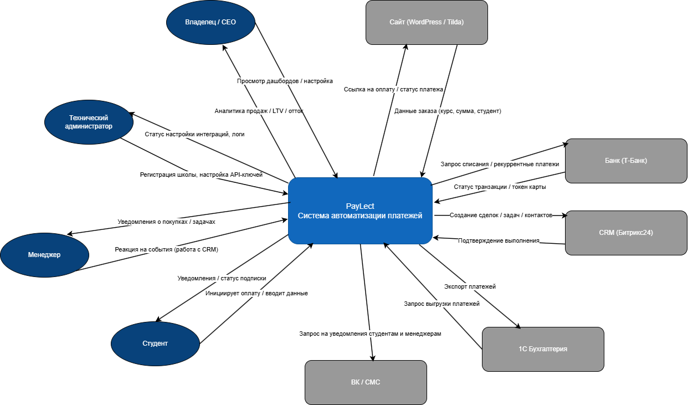

### 2. Контекст (среда и внешние системы)

Продукт функционирует в экосистеме онлайн-образования, где ключевые процессы распределены между несколькими независимыми сервисами: сайтом школы (WordPress / Tilda), платёжным эквайрингом (Т-Банк), CRM-системой (Битрикс24), бухгалтерской системой (1С) и каналами коммуникации (ВК).

PayLect выступает как связующий слой между этими системами, объединяя финансовые операции, данные о студентах и бизнес-логику в единый управляемый контур.

#### Контекстная диаграмма

*Рисунок 1 — Взаимодействие PayLect с внешними системами и пользователями*

#### Внешние сущности и потоки данных

| Внешняя сущность | Тип | Входящие в PayLect потоки | Исходящие из PayLect потоки |
|------------------|-----|---------------------------|----------------------------|
| Сайт школы (WordPress / Tilda) | Платформа | Данные заказа (сумма, курс, ID товара, телефон, ФИО студента) | Ссылка на оплату, статус платежа |
| Студент | Пользователь | Инициирует оплату (через виджет), вводит ФИО и телефон (в форме виджета) | Уведомления об оплате (ВК/СМС – каскадные уведомления), напоминания о предстоящих списаниях, подтверждения, статус подписки |
| Менеджер школы | Исполнитель | Реакция на события (работа с задачами в CRM, открытие доступа студентам) | Уведомления о новых покупках (ВК), уведомления о проблемных платежах (после 3 отказов) |
| Владелец / CEO школы | Исполнитель | Просмотр дашбордов, настройка API-ключей, управление интеграциями | Аналитика продаж: выручка по курсам, LTV, отток (churn), MRR, экспорт отчётов |
| Технический администратор школы | Исполнитель | Регистрация и подтверждение школы в личном кабинете PayLect, передача API-ключей для настройки интеграций | Подтверждение успешной настройки интеграций, статусы подключения (WordPress/Tilda, Битрикс24, 1С), логи операций |
| Банк-эквайер (Т-Банк) | Платёжный партнёр | Статус транзакции, токен карты, вебхуки о платежах | Запрос на списание, рекуррентный платёж, запрос статуса |
| CRM (Битрикс24) | Внешняя система | Подтверждение выполнения операций | Создание сделки, обновление статуса сделки, создание задачи менеджеру |
| 1С:Бухгалтерия | Учётная система | Запрос на выгрузку несинхронизированных платежей | Экспорт платежей (файл обмена в формате 1С), подтверждение синхронизации |
| ВК (Коммуникация) | Канал связи | Статус доставки сообщений, ответные сообщения (опционально) | Отправка уведомлений студентам (об успехе, отказе, напоминании), отправка уведомлений менеджерам (о новых покупках) |